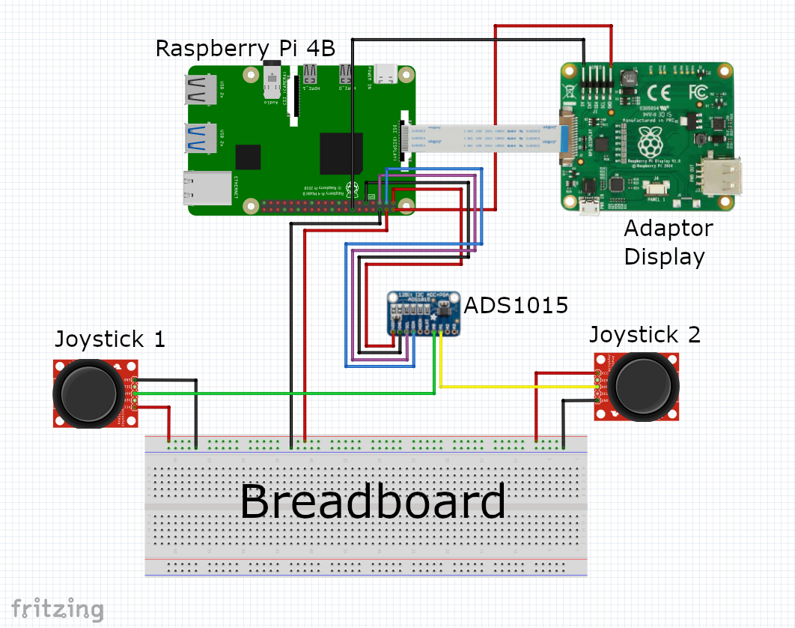
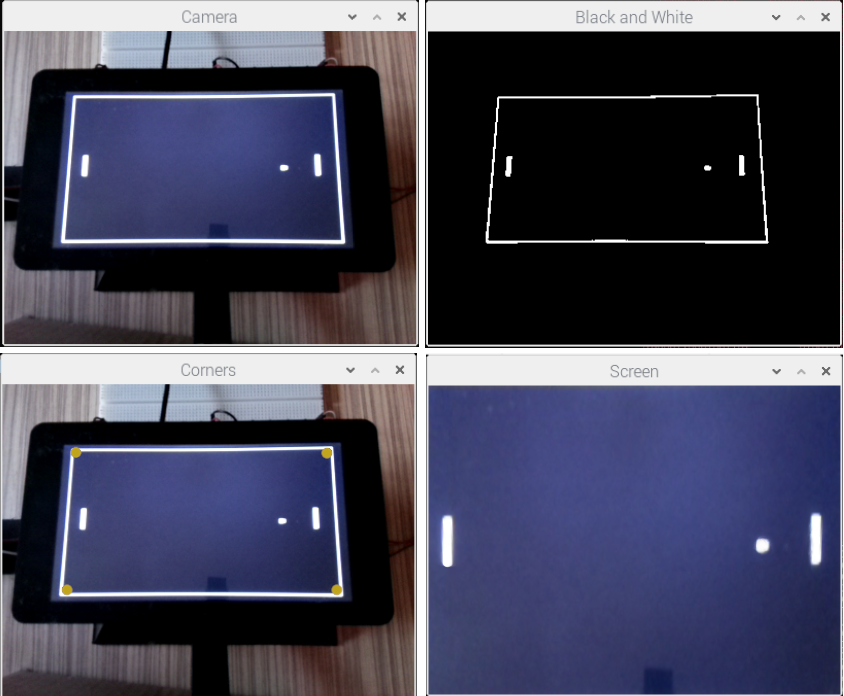
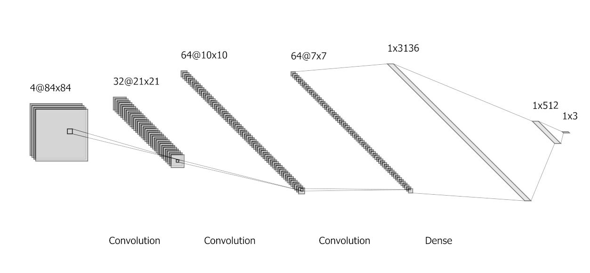
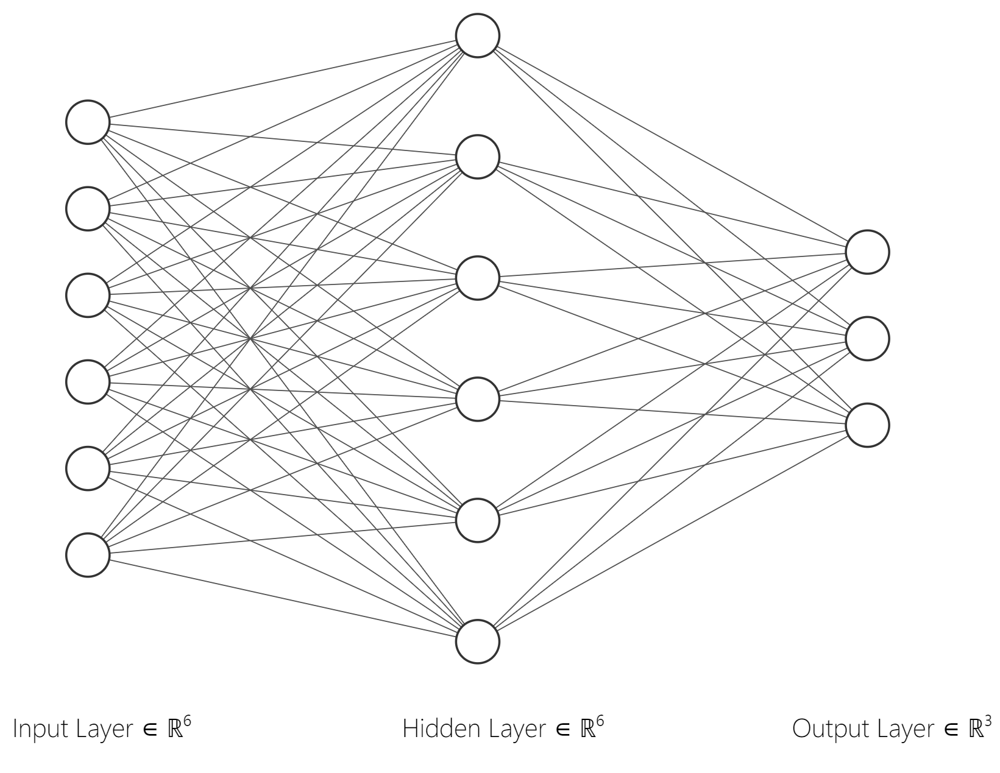

<h2>Check out the enhanced version of this presentation at <a href="https://radudilirici.github.io/autonomous-pong-robot/">https://radudilirici.github.io/autonomous-pong-robot/</a>.</h2>

<h2>Summary</h2>

This is my Bachelor's thesis. It consists of a small robot that can play the game Pong by physically controlling
one of the available joysticks.

The game is run and displayed on a <i>Raspberry Pi</i>. There are two joysticks attached to it that the players
can use to control the paddles.

The robot observes the state of the game through a camera and uses <b>Computer Vision</b> to extract the relevant
data.
Based on the processed information, it then computes what actions to play in order to win.
To act out the desired strategy, the robot operates one of the joysticks through a custom arm.

The project includes three separate methods for determining the robot's decisions.
The first one uses conventional programming and the other two are built using <b>Reinforcement Learning</b>
algorithms.

<h2>Demo</h2>

<figure>

https://github.com/radudilirici/autonomous-pong-robot/assets/27884873/5d9ba510-a81b-4542-a490-2646786e72e0

 
<figcaption>The robot, controlling the right joystick, playing against a person.</figcaption>

</figure>

 

<h2>Pong</h2>

For this project, a custom version of Pong that runs on <i>Raspberry Pi</i> was implemented.
The game is shown on a screen and it can be played using two joysticks.

The game is written in <b>Python 3</b> and uses Pygame.
It also takes advantage of <b>multithreading</b> to run at a consistent 60 frames per second.

The Pong game runs on a custom hardware setup that was built specifically for this project.
The circuit design can be observed in the next figure.

<figure>

 
<figcaption>The hardware system of the Pong game.</figcaption>

</figure>

 

<h2>Image Processing</h2>

The robot observes the state of the game through a small camera. This continuous flow of images has to be
processed before applying any game strategy.
This is a common step in all three algorithms. It was written in Python 3 and uses <a
href="https://docs.opencv.org/4.5.4/index.html">OpenCV</a>.

<figure>

 
<figcaption>
The process of cropping the image to the contents of the game.
 
The highlighted points represent the detected corners.
</figcaption>

</figure>
 

First, a binary threshold is applied to the input frame.
Based on the new image, the corners of the game are extracted using the contours of the objects.
Then, a four-point perspective transformation is applied to the area inside the corners.

By applying this process, the robot can process images even if it views the game from a bad angle.
For performance reasons, the corners are not recomputed on every iteration.
This detection is reapplied from time to time in case the camera or the display is moved.

<h2>Algorithms</h2>

The project includes three algorithms for the robot strategy. The first one consists of conventional
programming, and the other two are based on <b>Deep Q Learning</b> which is a form of Reinforcement
Learning.

<h3>The conventional method</h3>

The first algorithm uses classic programming to find out the optimal strategy.
After the initial image processing, the contours of the objects are extracted and their centers are computed.

The program uses the history of the ball's positions to calculate its current trajectory.

<figure>

https://github.com/radudilirici/autonomous-pong-robot/assets/27884873/5c1e0e94-5a4f-4a25-8786-a3d1c33da59b

 
<figcaption>
Data extraction example in slow motion (x0.5).
 
The paddles are marked with green dots, while the ball is labeled with red.
 
The yellow dot represents the prediction of where the ball will end up.
</figcaption>

</figure>
 

With this new information available, the program can now decide its next move.
If the ball is moving away from the robot's paddle, it tries to get to the middle of the screen.
Otherwise, the robot should aim to move to the predicted position.

Because of the limitations of the hardware components, namely the servomotor, the robot's actions suffer some
delay.
To compensate for this, the program uses some tricks to take into account the resulting "inertia".

This algorithm yields the best results out of all three.

<h3>Deep Q Learning</h3>

In order to train the models, simulated replicas of the game were built.
This was essential, so the training was not limited by the speed of the real Pong game.

One of the biggest difficulties encountered with the Reinforcement Learning approach was the difference between
the simulated environment and the real-life scenario.
One such example is the delay of the robotic arm. To ameliorate its impact, this delay was included in the
simulation, so that the models can learn to take it into consideration.

<h3>Deep Q Learning on images</h3>

The first algorithm that uses Reinforcement Learning operates directly on the images of the game.
For this, a custom <b>Convolutional Neural Network</b> was trained on the Pong replica using <b>PyTorch</b>.

<figure>

<figcaption>
The architecture of the Convolutional Neural Network.
 
The output of the network represents the three possible actions: move up, down, or stay.
</figcaption>
</figure>

This method doesn't have such good results, but it's the most versatile, as the robot learns everything on its
own.
This way, no previous knowledge of the game is required by the programmer.

<h3>Deep Q Learning on object positions</h3>

This method combines the two previously discussed approaches.
The coordinates of the objects are extracted and fed to the Reinforcement Learning model.

This provided several advantages over the first RL algorithm.
The input was easier for the model to interpret and the size and complexity of the neural network decreased
significantly.

<figure>

 
<figcaption>
The architecture of the new network.
</figcaption>

</figure>
 

This program results in a better player than the previous Q Learning method, but not as good as the
deterministic algorithm.
In terms of required knowledge, it also fits between the previous approaches.
The program is based on the assumption that we already know what the relevant data is in the system, but we do
not provide the winning strategy.

<h2>Conclusion</h2>

While the classic algorithm outperforms both Reinforcement Learning agents, it is based on the knowledge of the
programmer.

Moreover, its functionality is entirely dependent on the specific version of Pong.
Although the robot might be able to play some other game implementations, it would most likely require adjustments
to properly process the input.

The intelligent methods would also have to learn about other Pong versions, but the process would be more
automatic.
Furthermore, the resulting program would likely be the most capable one of playing a new version of the game.

